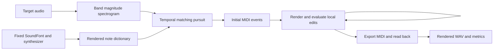

# Speaking MIDI

An experimental system for approximating speech and other audio with MIDI rendered through a fixed piano SoundFont. The system searches for note events whose synthesized audio resembles a target recording. It models the piano's harmonics, attack, decay, velocity response, and note release using audio generated by the actual synthesizer.

The first experiment uses locally generated Qwen3-TTS speech. Compared with a calibrated spectral-peak baseline, the final system reduced log-band spectral error by **18.4% for Chinese and 17.1% for English**. Reliable speech intelligibility has not been demonstrated: auxiliary speech recognition still fails on most of the piano output. See [RESULTS.md](RESULTS.md) for measurements and listening links.

## Running the experiment

The existing workstation environment uses `.venv` with the installed CUDA-enabled PyTorch. Additional Python dependencies are installed in that virtual environment. FluidSynth and SoX are available from Ubuntu packages extracted into `.local` without modifying the system installation.

```bash
# Generate Chinese and English speech using the standard Hugging Face cache.
scripts/env.sh scripts/generate_speech.py

# Fit the generated recordings and export MIDI, audio, and evaluation artifacts.
scripts/env.sh -m speaking_midi outputs/tts/zh.wav --out outputs/zh
scripts/env.sh -m speaking_midi outputs/tts/en.wav --out outputs/en

# Run the implementation checks.
scripts/env.sh -m unittest discover -s tests -v
```

If the standard model download is unreliable, use the resumable mirror downloader instead of the first command above:

```bash
python3 scripts/download_model.py
scripts/env.sh scripts/generate_speech.py --model-path .local/models/qwen3-tts
```

The mirror downloader connects directly to `hf-mirror.com`, checks partial response ranges, and verifies each assembled weight file against its published SHA256. It records the model revision and stores the model in `.local/models/qwen3-tts`.

To fit another audio file or select another SoundFont:

```bash
scripts/env.sh -m speaking_midi /absolute/path/to/input.wav \
  --soundfont /absolute/path/to/instrument.sf3 \
  --out outputs/custom \
  --max-notes 240
```

The preset remains bank 0, program 0; changing the SoundFont does not automatically select a piano preset in an arbitrary bank layout. `--max-notes` bounds pursuit iterations, not the final number of notes. Rejected end-of-recording candidates can consume iterations, and refinement can delete notes.

On a new machine, use Python 3.10 or later, create `.venv`, install `requirements.txt`, and install the native FluidSynth library and SoX. Choose a PyTorch distribution compatible with the GPU and driver. The pursuit implementation also supports CPU execution; the provided TTS generation script explicitly uses CUDA. Optional ASR evaluation requires `faster-whisper` and its model weights.

`scripts/env.sh` changes to the project root, adds the local native libraries and executables to the search paths, and defaults HTTP/HTTPS proxy settings to `http://localhost:1091`. Override those variables for another environment, or invoke the virtual environment's Python directly if the native libraries are installed system-wide. The SoundFont is referenced in place, not copied into the project.

## Problem formulation

A MIDI candidate is a set of note events:

\[
M = \{(p_i, v_i, s_i, d_i)\}_{i=1}^{N},
\]

where each event specifies pitch, velocity, onset time, and key-hold duration. Let \(R_\theta(M)\) denote the audio produced by a synthesizer with fixed settings \(\theta\). The objective is to find a compact event set whose rendered audio is close to target waveform \(y\):

\[
\min_M D\bigl(y, R_\theta(M)\bigr).
\]

This is a discrete inverse-synthesis problem. The synthesizer is the forward model, and the search tries to infer useful controls for it. Qwen3-TTS supplies test recordings; it does not predict MIDI or participate in fitting. The current fitter is an optimization procedure without a trained speech-to-MIDI network.

A piano key produces several coupled harmonics rather than an independently adjustable frequency. For example, selecting a note near 440 Hz already introduces energy near its higher harmonics. Selecting additional keys near 880 Hz and 1320 Hz can duplicate that energy and add further harmonics. Velocity also affects timbre, and holding or releasing a key changes its temporal envelope. A useful inverse model must account for these effects when selecting notes.

The implementation uses two stages: an efficient approximate search over measured note templates, followed by local search using actual synthesized waveforms.



## Fixed rendering conditions

The default SoundFont is `/home/camus/work/LilyScript/web/soundfont/gm.sf3`. Its bank 0, program 0 preset was read back as **Grand Piano**.

| Setting | Value |
|---|---|
| Sample rate | 24,000 Hz |
| Synthesizer gain | 0.8 |
| Preset | Bank 0, program 0 |
| Reverb and chorus | Disabled |
| Synthesizer polyphony | 512 voices |
| MIDI channel | 0 |
| Sustain pedal and pitch bends | Not used |

The renderer mixes stereo output to mono. Key-hold duration means the interval between note-on and note-off; the audible release can continue afterward. Different pitches can overlap, but the search prohibits overlapping key-hold intervals for the same pitch. A released note's tail may overlap a later strike of that key.

Fixing these settings is part of the model definition. Playing the resulting MIDI through another instrument, gain setting, or effects chain changes the reconstruction. Dictionary metadata records the SoundFont hash, preset name, analysis settings, and renderer revision. A hash of the locally bundled FluidSynth library is included when available; a system library is recorded as `system` rather than fingerprinted.

## Algorithm details

### 1. Prepare a common target representation

Input channels are averaged, resampled to 24 kHz, and scaled to RMS amplitude 0.035 over the whole recording. Nonfinite and effectively silent inputs are rejected. Every method uses this same target; outputs are not individually loudness-normalized.

The analysis uses a centered short-time Fourier transform (STFT) with a Hann window:

- FFT size: 2,048 samples, approximately 85.3 ms.
- Hop: 240 samples, or 10 ms.
- Frequency-bin spacing: approximately 11.72 Hz.
- Boundary padding: zeros.

Let \(S(y)=|\operatorname{STFT}(y)|\). Multiplication by a nonnegative filter bank \(B\) produces the fitting features:

\[
Y = F(y) = B S(y).
\]

The filter bank contains 96 triangular bands, with edges spaced on a mel-like frequency scale from 60 Hz to 10 kHz. Features are sums of **magnitudes**, not power spectra, decibel spectra, or complex STFT coefficients. This reduces the frequency dimension and tolerates some frequency mismatch while retaining the broad spectral shape associated with speech formants.

The 10 ms hop defines the onset search grid, but does not imply independent 10 ms acoustic resolution: adjacent features share an approximately 85 ms analysis window.

### 2. Measure a dictionary of complete piano events

The dictionary contains every combination of:

| Parameter | Values |
|---|---|
| MIDI pitch | 36 through 108, inclusive: 73 pitches |
| Velocity | 45, 75, 105 |
| Key-hold duration | 60, 120, 240 ms |

This gives \(73\times3\times3=657\) templates. Each event starts at time zero and is rendered for 540 ms, then transformed with the same feature extractor as the target. The resulting dictionary has shape **657 × 96 × 55**: template, frequency band, and time frame.

Each atom \(A_k\) therefore describes an evolving spectrum, including attack, decay, and some release energy. All atoms have the same total length. The longest hold leaves 300 ms for release; shorter holds leave more. Any audio remaining beyond 540 ms is truncated in the dictionary, even though the synthesizer may produce a longer tail during full reconstruction.

Measuring separate velocities avoids assuming that MIDI velocity simply scales a fixed spectrum. No fitted continuous amplitude coefficient is converted into a guessed velocity: the initial search selects one of the measured discrete events directly. The dictionary is cached in `outputs/cache/` using its configuration hash.

### 3. Select events with temporal matching pursuit

The approximation assumes that shifted note **magnitude features** add:

\[
\widehat{Y} \approx \sum_i T_{t_i} A_{k_i},
\]

where \(T_t\) places an atom at onset frame \(t\). This provides a fast surrogate for evaluating many potential MIDI events.

To reduce domination by the strongest frequency bands, calculate the target RMS in each band and apply a weight:

\[
r_b = \sqrt{\frac{1}{T}\sum_t Y_{b,t}^2},
\qquad
w_b = \frac{1}{\sqrt{\max(r_b,0.15)}}.
\]

Apply the same weights to target and atoms: \(\widetilde{Y}=w\odot Y\) and \(\widetilde{A}_k=w\odot A_k\). The floor limits amplification of nearly empty bands. Initialize the residual as \(E=\widetilde{Y}\), padded with zeros on the right so that full atoms can be scored near the end.

For an eligible atom at a candidate onset, the reduction in squared residual norm is:

\[
\begin{aligned}
\Delta(k,t)
&= \|E\|_F^2 - \|E-T_t\widetilde{A}_k\|_F^2 \\
&= 2\langle E,T_t\widetilde{A}_k\rangle
   - \|\widetilde{A}_k\|_F^2.
\end{aligned}
\]

The cross-correlation term is computed for all atoms and positions with PyTorch `conv1d`, using CUDA when available. The atom-energy term penalizes selecting notes that introduce more energy than the residual can support.

At each iteration:

1. Select the eligible atom and onset with the largest positive \(\Delta\).
2. Reject a candidate if its key-hold interval would extend beyond the input duration.
3. Add its measured pitch, velocity, duration, and grid-aligned onset to the event list.
4. Subtract the shifted atom from the residual.
5. Mask future candidates whose key-hold intervals would overlap it at the same pitch.

The residual is allowed to become negative. Negative regions represent over-explained energy and discourage further additions there. Clamping them to zero would discard that penalty.

Search stops when no positive improvement remains or the iteration limit is reached. The event budget and stopping rule encourage a compact solution, but there is no explicit L1 penalty or globally optimal sparse solver. Greedy choices can prevent better combinations from being selected later.

### 4. Refine using the actual synthesizer

Magnitude addition is approximate: in general,

\[
|\operatorname{STFT}(a+b)|
\ne |\operatorname{STFT}(a)|+|\operatorname{STFT}(b)|.
\]

Phase interactions, the finite dictionary tail, and centered-window onset boundaries all cause differences between the surrogate and actual audio. The refinement stage renders complete candidate event sets through FluidSynth and evaluates:

\[
D_{\log}(y,\hat y)
= \frac{1}{96T}\sum_{b,t}
\left|\log(1+F(y)_{b,t})-\log(1+F(\hat y)_{b,t})\right|.
\]

The logarithm compresses strong components so they contribute less disproportionately than in a linear magnitude loss. This objective differs from the weighted squared loss used during pursuit; reducing one does not necessarily reduce the other.

Refinement first tests global velocity offsets of −12, −6, +6, and +12 against the unchanged dictionary solution. Velocities are clipped to 1–127. It then makes one pass through the surviving events in reverse insertion order. For each event it tests seven alternatives:

- Velocity −10 or +10.
- Onset −10 ms or +10 ms.
- Key-hold duration −20 ms or +20 ms.
- Event deletion.

The best measured improvement is accepted. These alternatives are evaluated separately, not as all combinations of parameter changes. Onsets must be nonnegative, holds must last at least 20 ms and end within the input, and same-pitch key-hold overlaps remain forbidden.

The local pass does not change pitch, add new events, or iterate until convergence. It can move velocities and durations away from the dictionary grid, but remains a limited coordinate search. There is no differentiable synthesizer or backpropagation through FluidSynth.

Candidates during refinement are rendered from their event lists. For each saved method, the code exports a MIDI file, reads it back, and renders that decoded sequence for the reported metrics. This checks the actual exported representation rather than reporting only the dictionary approximation.

### 5. Export timing and measure rendering variability

MIDI files use 1,000 ticks per beat and a tempo of 500,000 microseconds per beat, giving 2,000 ticks per second. Times are rounded to this 0.5 ms grid. Note-off events precede note-on events at a shared tick, allowing repeated strikes without same-key ambiguity.

FluidSynth is warmed up and synthesis buffers are drained between renders. Small first-voice, block-boundary, and int16 dithering differences remain possible; output is not claimed to be bitwise deterministic. The control test requires repeat-render spectral convergence below 1%, and each experiment records the final reconstruction's repeat-render distance and change in target loss.

## Spectral-peak baseline

The baseline is a locally implemented heuristic comparison. It uses the same STFT, averages each group of six frames, and selects up to eight local spectral peaks between 65 Hz and 4.2 kHz. Peaks below the larger of 0.15 or 1.5% of the recording's maximum STFT magnitude are dropped.

Each selected frequency maps to the nearest equal-tempered MIDI pitch:

\[
p=\operatorname{round}\left(69+12\log_2(f/440)\right).
\]

Duplicate pitches within the group and pitches outside 36–108 are discarded. Notes last 60 ms. Initial velocity is a clipped logarithmic function of peak magnitude relative to the recording-wide maximum:

\[
v=\operatorname{int}\left[\operatorname{clip}
\left(90+25\log_{10}(a/a_{\max}),30,110\right)\right].
\]

To reduce simple loudness mismatch, actual rendered candidates are compared at global velocity offsets −36, −24, −12, 0, and +12, choosing the lowest log-band loss. This calibration uses the renderer, but the baseline's pitch and timing decisions do not model piano spectra or envelopes. Its note count is not matched to the dictionary method, so the experiment is not an equal-budget ranking.

## Outputs and evaluation

Each `outputs/<name>/` directory contains:

| Artifact | Contents |
|---|---|
| `target.wav` | Resampled target at the common RMS level |
| `baseline.{mid,wav,json}` | Calibrated baseline MIDI, rendering, and decoded events |
| `dictionary.{mid,wav,json}` | Initial dictionary solution |
| `refined.{mid,wav,json}` | Result after actual-renderer refinement |
| `metrics.json` | Metrics, configuration, hashes, pursuit scores, global velocity trials, repeatability, and runtime |
| `listen.html` | Audio players for the target and three reconstructions |
| `spectrogram.png` | Spectrogram comparison with shared display limits |

Original TTS recordings and generation metadata remain in `outputs/tts/`.

The primary reported distance is `log_band_mae`, defined above. Linear STFT spectral convergence is also reported:

\[
\operatorname{SC}(y,\hat y)
=\frac{\|S(y)-S(\hat y)\|_F}{\|S(y)\|_F}.
\]

Both are lower-is-better measures. Waveform RMSE is recorded but is sensitive to phase, making it difficult to interpret as perceptual speech similarity. Note count and audio peak help characterize the candidate without asserting intelligibility.

Metrics crop reconstruction audio to the input duration. Saved WAV files include an additional 0.5 seconds of tail, which is **not penalized in the reported loss**. Pursuit differs here: its zero-padded residual does penalize dictionary energy beyond the target boundary within the atom's support.

For auxiliary ASR evaluation:

```bash
# Uses the existing local faster-whisper-base cache by default.
scripts/env.sh scripts/evaluate_asr.py
# Or provide a local model directory explicitly.
scripts/env.sh scripts/evaluate_asr.py --model-path /path/to/whisper-model
```

The script writes `outputs/asr.json` and measures both original targets and reconstructed audio. Chinese uses character error rate (CER); English uses word error rate (WER). An ASR model may hallucinate text on piano audio, and incidental matching characters do not establish intelligibility. For listening evaluation, record what you hear before consulting the transcript in `outputs/tts/manifest.json`. No human blind-listening study has been completed.

## Implementation map and limitations

| File | Responsibility |
|---|---|
| `speaking_midi/core.py` | Rendering, MIDI I/O, features, dictionary, pursuit, baseline, and metrics |
| `speaking_midi/__main__.py` | Experiment orchestration, local refinement, plots, and listening page |
| `scripts/generate_speech.py` | Qwen3-TTS sample generation and provenance |
| `scripts/download_model.py` | Resumable, verified model download through a mirror |
| `scripts/evaluate_asr.py` | Auxiliary transcription and error-rate calculation |
| `tests/test_roundtrip.py` | MIDI round-trip, rendering repeatability, and known single-note recovery |

The tests establish operation on limited controls, not general speech reconstruction quality. Piano attacks and decays constrain envelope matching; its coupled harmonics constrain spectral matching; unvoiced consonants and continuously changing speech pitch are especially difficult with discrete piano keys. A finite template grid, greedy initialization, and one local refinement pass add optimization limitations on top of those instrument constraints.

Useful next experiments include lower velocities, denser duration grids, multiple analysis resolutions, repeated local search, explicit tail penalties, and evaluation across speakers and held-out phrases. Spectral fidelity and intelligibility should be measured separately. ASR is an auxiliary evaluator, not the optimization target in this implementation.

## References

- [Qwen3-TTS source](https://github.com/QwenLM/Qwen3-TTS) and [0.6B CustomVoice model card](https://huggingface.co/Qwen/Qwen3-TTS-12Hz-0.6B-CustomVoice). The experiment uses the built-in Vivian and Ryan voices and records model provenance with the generated samples.
- [FluidSynth](https://www.fluidsynth.org/) and [pyFluidSynth](https://github.com/nwhitehead/pyfluidsynth), used for the fixed instrument renderer.
