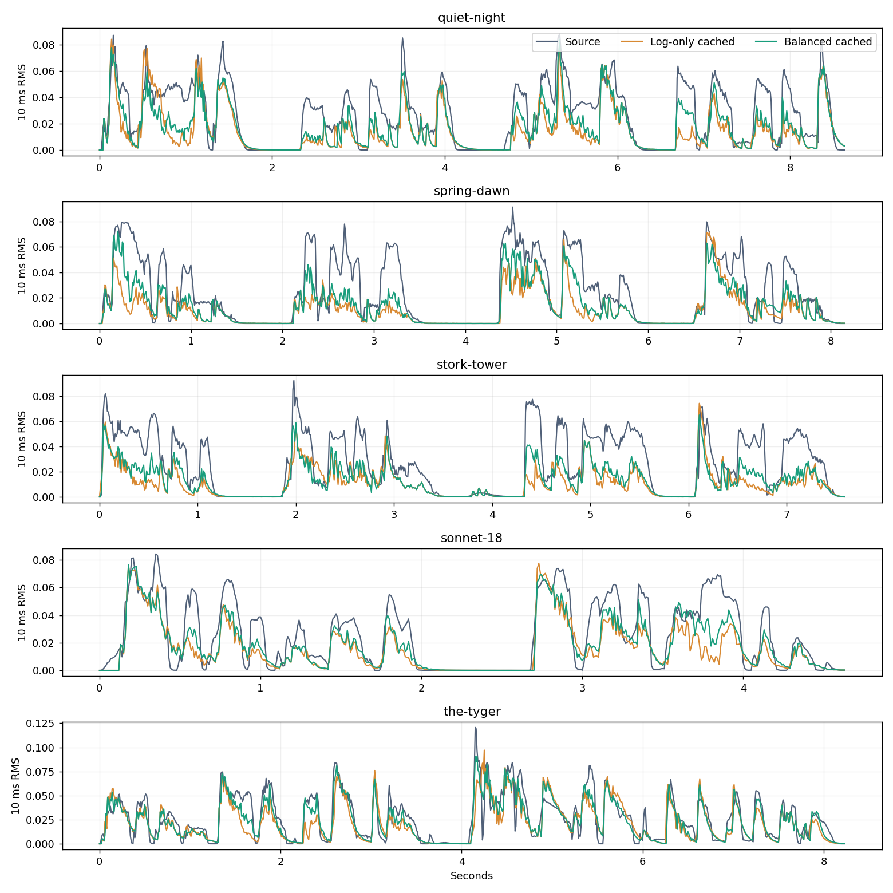

# Balanced spectral and envelope fitting

Date: 2026-10-02.

This follows the [five-poem backtest](POETRY_BACKTEST.md). The previous cached optimizer reduced log-band error but worsened envelope correlation on every recording. This experiment changes the objective while retaining the same cached waveform search, four passes, candidate edits, fixed target RMS, SoundFont, and initial quick MIDI files.

## Outcome

Across the same five full recordings, mean log-band MAE decreases from **0.40846 to 0.39613 (3.02%)** relative to the original full-render optimizer. Mean linear spectral convergence decreases from **0.8070 to 0.7736**; mean envelope correlation increases from **0.7879 to 0.8774**. Each recording improves on all three measures. These are corpus averages, not confidence intervals.

The balanced method gives back some log-band improvement compared with the previous log-only cached method. Multi-resolution log error increases slightly on three recordings. The result is a better measured compromise, not proof of better perceived quality or intelligible speech.

| Recording | Log MAE: original → balanced | Linear SC: original → balanced | Envelope correlation: original → balanced |
|---|---:|---:|---:|
| 静夜思 | 0.45781 → 0.44565 | 0.8032 → 0.7656 | 0.8123 → 0.8664 |
| 春晓 | 0.39866 → 0.38841 | 0.8087 → 0.7764 | 0.7992 → 0.8762 |
| 登鹳雀楼 | 0.41529 → 0.40218 | 0.8383 → 0.7899 | 0.7109 → 0.8677 |
| Sonnet 18 (opening couplet) | 0.35065 → 0.34172 | 0.7608 → 0.7314 | 0.8148 → 0.8731 |
| The Tyger (first stanza) | 0.41991 → 0.40270 | 0.8239 → 0.8049 | 0.8022 → 0.9037 |

## Objective and implementation

Let $S$ be the linear STFT magnitude at FFT size 2048 / hop 240, and $E$ the RMS envelope in nonoverlapping 240-sample (10 ms) frames. The final envelope frame is zero-padded. All comparisons use the input interval; saved audio retains the original 0.5-second release tail. No candidate loudness normalization or time alignment is applied.

$$
L = L_{\mathrm{logband}} + \lambda_s\frac{\|S(\hat y)-S(y)\|_F}{\|S(y)\|_F} + \lambda_e\left(\frac{\|E(\hat y)-E(y)\|_2}{\|E(y)\|_2} + 1-\rho(E(\hat y),E(y))\right).
$$

The selected weights are $\lambda_s=\lambda_e=0.05$. The envelope NRMSE term penalizes amplitude mismatch; correlation emphasizes timing and shape. Using correlation alone would allow incorrect overall amplitude. Linear spectral convergence counterbalances the log objective’s emphasis on quieter frequency bins. Weights are tied to the existing signal calibration and feature definition; they are not universal perceptual constants.

Candidate evaluation still subtracts/adds cached single-note waveforms, with block-phase alignment and batched GPU or CPU STFTs. Every complete pass is re-rendered through FluidSynth and accepted only if this **combined objective** improves. The original log-only pass guard is not imposed on balanced runs; individual metrics may trade off. MIDI is exported, reloaded and rendered before final scoring. Three further full renders per sample are recorded in the JSON to expose renderer variability.

## Parameter selection

The five weights 0.025, 0.05, 0.1, 0.2 and 0.4 were explored on Quiet Night Thoughts and Sonnet 18. Both spectral and envelope weights move together in this sweep. The selection is exploratory: after inspecting those pilots, 0.05 was chosen because 0.025 barely restored Quiet Night’s envelope correlation, while stronger weights sacrificed more log-band fidelity. The choice was recorded before evaluating Spring Dawn, Stork Tower and The Tyger. Those three are an internal validation set from the same previously evaluated TTS corpus, not independent held-out voices.

| Pilot | Weight | Log MAE | Linear SC | Envelope correlation |
|---|---:|---:|---:|---:|
| quiet-night | 0.025 | 0.44126 | 0.7885 | 0.8161 |
| quiet-night | 0.05 | 0.44565 | 0.7656 | 0.8664 |
| quiet-night | 0.1 | 0.45544 | 0.7558 | 0.9184 |
| quiet-night | 0.2 | 0.46859 | 0.7507 | 0.9424 |
| quiet-night | 0.4 | 0.47911 | 0.7519 | 0.9495 |
| sonnet-18 | 0.025 | 0.33777 | 0.7514 | 0.8440 |
| sonnet-18 | 0.05 | 0.34172 | 0.7314 | 0.8731 |
| sonnet-18 | 0.1 | 0.34799 | 0.7253 | 0.9002 |
| sonnet-18 | 0.2 | 0.35838 | 0.7179 | 0.9249 |
| sonnet-18 | 0.4 | 0.36413 | 0.7188 | 0.9314 |

## Ablation at weight 0.05

All variants use the same quick initialization and four cached passes. Log-only is the previous experiment; spectral-only and envelope-only retain log-band loss and add just the indicated term. These ablations were run on the two pilots after selecting the joint weight; they did not select another weight for the validation recordings.

| Pilot | Added terms | Log MAE | Linear SC | Envelope correlation |
|---|---|---:|---:|---:|
| quiet-night | None | 0.43985 | 0.8198 | 0.7418 |
| quiet-night | Linear spectrum | 0.43987 | 0.7955 | 0.7655 |
| quiet-night | Envelope | 0.44458 | 0.7923 | 0.8554 |
| quiet-night | Both | 0.44565 | 0.7656 | 0.8664 |
| sonnet-18 | None | 0.33664 | 0.7756 | 0.7936 |
| sonnet-18 | Linear spectrum | 0.33630 | 0.7580 | 0.7932 |
| sonnet-18 | Envelope | 0.34110 | 0.7518 | 0.8699 |
| sonnet-18 | Both | 0.34172 | 0.7314 | 0.8731 |

Adding the envelope term is responsible for most of the temporal-envelope improvement. Adding linear spectral convergence improves that metric further in these pilots. A different objective changes the discrete search trajectory, so these gains are not additive.

## Tradeoffs and cost

| Recording | Log-only → balanced log MAE | Original → balanced multi-resolution log MAE | Balanced refinement time |
|---|---:|---:|---:|
| quiet-night | 0.43985 → 0.44565 | 0.08130 → 0.08101 | 15.3 s |
| spring-dawn | 0.38120 → 0.38841 | 0.07410 → 0.07477 | 12.5 s |
| stork-tower | 0.39341 → 0.40218 | 0.07050 → 0.07095 | 12.7 s |
| sonnet-18 | 0.33664 → 0.34172 | 0.05494 → 0.05502 | 7.3 s |
| the-tyger | 0.39923 → 0.40270 | 0.07807 → 0.07639 | 20.6 s |

The full Sonnet 18 CPU refinement took **25.8 s**: log MAE 0.34168, linear SC 0.7325, envelope correlation 0.8745. This excludes dictionary construction, initialization and TTS. GPU/CPU rounding can lead to different accepted notes. Timings were collected on the local RTX 3090 workstation with concurrent experiments and are observational, not isolated performance benchmarks.



## ASR and remaining limitations

The selected five WAV files were transcribed with the same unprompted faster-whisper-base CPU int8 protocol used previously. Each transcription records the exact audio SHA-256. Chinese scores are CER and English scores are WER; insertions can make either exceed 100%.

| Recording | Balanced CER/WER |
|---|---:|
| quiet-night | 100.0% |
| spring-dawn | 95.0% |
| stork-tower | 120.0% |
| sonnet-18 | 93.8% |
| the-tyger | 100.0% |

Transcriptions remain incorrect or empty. Incidental matching words and lower insertion counts do not demonstrate intelligibility. No blind human listening study has been performed. Five recordings from one synthetic voice cannot establish generalization. Envelope correlation is now an optimized quantity, not independent evidence of perceptual improvement. Multi-resolution error remains an auxiliary metric and exposes some of the tradeoff.

## Reproduction and usage

First reproduce the existing quick MIDI initializations using the preceding report. Then run:

```bash
OPENBLAS_NUM_THREADS=1 scripts/env.sh -m experiments.balanced_search --weights .025 .05 .1 .2 .4
OPENBLAS_NUM_THREADS=1 scripts/env.sh -m experiments.balanced_search --weights .05 --only spring-dawn stork-tower the-tyger
OPENBLAS_NUM_THREADS=1 scripts/env.sh -m experiments.balanced_search --component spectral --weights .05
OPENBLAS_NUM_THREADS=1 scripts/env.sh -m experiments.balanced_search --component envelope --weights .05
OPENBLAS_NUM_THREADS=1 scripts/env.sh -m experiments.balanced_search --device cpu --weights .05 --only sonnet-18 --out outputs/balanced-cpu
scripts/env.sh -m experiments.select_balanced
OPENBLAS_NUM_THREADS=1 scripts/env.sh -m experiments.poetry_asr --root outputs/balanced-selected --variants balanced
OPENBLAS_NUM_THREADS=1 scripts/env.sh -m experiments.package_balanced
scripts/env.sh -m experiments.write_balanced_report
```

For another input, the experimental CLI exposes the combined objective explicitly:

```bash
OPENBLAS_NUM_THREADS=1 scripts/env.sh -m speaking_midi.optimize \
  examples/poetry/quiet-night.wav --out outputs/balanced-demo \
  --passes 4 --objective balanced --balance-weight .05 --device auto
# Use --device cpu to force CPU pursuit and refinement.
```

The CLI default remains the log-only experimental optimizer. [balanced-results.json](balanced-results.json) contains every pilot weight, the ablations, per-sample metrics, ASR transcripts and CPU results. Open `outputs/balanced-selected/index.html` for source / original / log-only / balanced playback and MIDI downloads. The HF demo is unchanged.

## Next research questions

Further tuning these five clips is unlikely to establish speech intelligibility. A useful next stage is phoneme-level or auditory-band envelope evaluation with a larger independent voice corpus and blinded listeners. Within this renderer, test finer low-velocity templates and residual-driven note insertion against the frozen balanced baseline, while reporting a complexity budget and all acoustic tradeoffs. A multi-resolution term could target the remaining regression, but adding more correlated losses should be evaluated on new data before choosing another default.
