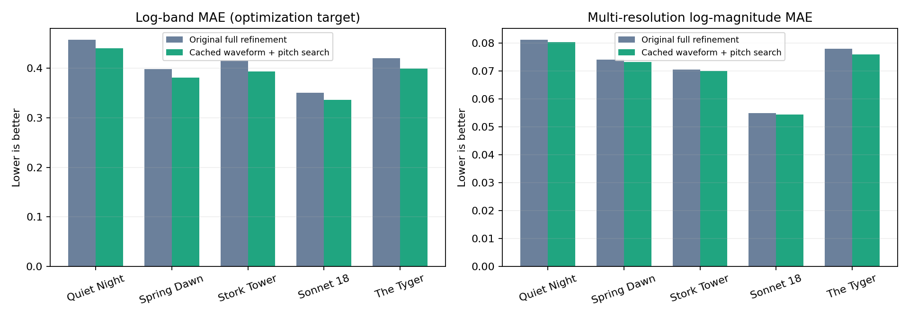

# Poetry fitting backtest and cached-waveform refinement

Date: 2026-10-02.

## Scope and protocol

All five recordings in `examples/poetry` are evaluated in full. No new TTS was generated. The copied source files are verified against SHA-256 hashes. This task has no ground-truth MIDI transcription: “accuracy” here means acoustic reconstruction error, with a separate unprompted ASR check.

Every method uses 24 kHz mono, target RMS 0.035, the same `gm.sf3` Grand Piano preset, gain 0.8, no reverb/chorus, and a 0.5-second output release tail. Metrics exclude that tail, use identical alignment, and apply no output loudness normalization. Measurements use audio re-rendered from exported MIDI. The dictionary has 657 templates (73 pitches × 3 velocities × 3 gate durations).

The primary reference is the original research algorithm: 240 greedy search iterations, global velocity calibration, and one exact-renderer coordinate sweep over velocity, onset, duration, and deletion. The new method starts from the same quick calibrated MIDI, then performs four cached-waveform sweeps with pitch edits. It does not run the slow original refinement first. The live demo’s 80-iteration quick setting is measured separately. Note counts may differ because each search can delete notes; both 240-iteration methods start with the same candidate budget.

## Primary result

Mean log-band MAE: **0.40846 → 0.39007**, a **4.50%** reduction. This is a five-example result, not a population estimate or proof of intelligible piano speech.

| Recording | Duration | Original full | Cached + pitch | Reduction | Notes, original → new |
|---|---:|---:|---:|---:|---:|
| 静夜思 | 8.64 s | 0.45781 | 0.43985 | 3.92% | 147 → 151 |
| 春晓 | 8.16 s | 0.39866 | 0.38120 | 4.38% | 117 → 121 |
| 登鹳雀楼 | 7.60 s | 0.41529 | 0.39341 | 5.27% | 134 → 134 |
| Sonnet 18 (opening couplet) | 4.64 s | 0.35065 | 0.33664 | 3.99% | 80 → 84 |
| The Tyger (first stanza) | 8.24 s | 0.41991 | 0.39923 | 4.93% | 182 → 187 |



The comparison chart includes a secondary multi-resolution log-magnitude metric at FFT sizes 512, 1024, and 2048. It is not the training objective. Linear spectral convergence and temporal-envelope correlation are also reported below; none of these measures alone establishes intelligibility.

| Recording | Linear spectral convergence, old → new | Multi-resolution log MAE, old → new | Envelope correlation, old → new |
|---|---:|---:|---:|
| quiet-night | 0.8032 → 0.8198 | 0.08130 → 0.08039 | 0.8123 → 0.7418 |
| spring-dawn | 0.8087 → 0.8183 | 0.07410 → 0.07333 | 0.7992 → 0.7344 |
| stork-tower | 0.8383 → 0.8426 | 0.07050 → 0.07000 | 0.7109 → 0.6788 |
| sonnet-18 | 0.7608 → 0.7756 | 0.05494 → 0.05440 | 0.8148 → 0.7936 |
| the-tyger | 0.8239 → 0.8167 | 0.07807 → 0.07598 | 0.8022 → 0.7966 |

The multi-resolution log error decreases on all five recordings, but linear spectral convergence worsens on four and envelope correlation decreases on all five. The new search improves the selected log objective at the expense of other aspects of the reconstruction; it is not a uniform quality improvement.

## Demo settings and cost

| Recording | Demo 80 quick MAE | Research 240 quick MAE | Original refinement | Cached refinement |
|---|---:|---:|---:|---:|
| quiet-night | 0.49112 | 0.47560 | 464.8 s | 14.5 s |
| spring-dawn | 0.42356 | 0.41231 | 290.9 s | 11.7 s |
| stork-tower | 0.44963 | 0.43310 | 349.9 s | 12.5 s |
| sonnet-18 | 0.36881 | 0.36575 | 99.8 s | 6.8 s |
| the-tyger | 0.46922 | 0.44634 | 813.0 s | 18.1 s |

Refinement times exclude dictionary construction and greedy initialization. Original refinement includes global calibration; cached refinement starts after that calibration (recorded separately in the JSON). These are observational wall-clock measurements on the local RTX 3090 workstation during concurrent backtests, not an isolated throughput benchmark. Cached spectral candidate evaluation uses CUDA; FluidSynth stays on CPU.

A full CPU-only cached-refinement check on Sonnet 18 completed in **22.77 s**, with log-band MAE **0.33587**. CPU/GPU numerical differences can change the discrete search trajectory. This CPU timing covers refinement, not initialization or TTS.

## Algorithm changes

1. **Cache block-aligned single-note waveforms.** FluidSynth with disabled effects is approximately additive below clipping. Cache keys include pitch, velocity, gate length in samples, and onset modulo the renderer’s 64-sample block. Each cached waveform includes an 0.8-second release. Ignoring the block phase would misalign note attacks.
2. **Replace full renders of every candidate with waveform updates.** Anchor the current estimate to a true full render. For a note replacement, subtract the old cached waveform and add the new one. Batch STFT and log-band losses across the candidates on CUDA, with a CPU fallback.
3. **Search pitch as well as velocity and timing.** The first pass tries velocity ±10, onset ±20 ms, gate ±40 ms, pitch ±1/±2 semitones, and deletion. Later passes use velocity ±5, onset ±10 ms and gate ±20 ms, retaining the pitch/deletion candidates. Same-pitch overlap and clip boundaries remain forbidden.
4. **Verify every pass with the real synthesizer.** Accept a pass only if its full FluidSynth render reduces the original log-band objective; otherwise roll back the entire pass. Rebase the waveform estimate after every accepted pass. Export and reload MIDI for final metrics. This is discrete search, not a differentiable FluidSynth model.

## Ablation: extra search versus pitch search

The following two variants both start from the original fully refined MIDI and run two cached passes. One disables pitch edits. This separates some of the benefit of more iterations from pitch freedom; adding pitch also adds candidate evaluations, so it is not an equal-compute comparison.

| Recording | Original full | Two cached passes, no pitch | Two cached passes, pitch |
|---|---:|---:|---:|
| quiet-night | 0.45781 | 0.44249 | 0.44145 |
| spring-dawn | 0.39866 | 0.38390 | 0.38224 |
| stork-tower | 0.41529 | 0.39759 | 0.39546 |
| sonnet-18 | 0.35065 | 0.33901 | 0.33791 |
| the-tyger | 0.41991 | 0.40522 | 0.40303 |

Most of the practical change is cheaper search and additional opportunities to adjust events. Pitch edits must be judged by this ablation; they should not receive credit for the entire improvement.

## Rejected prototype and references

A separate prototype ranked additions using a log-domain gradient and a quadrature-magnitude surrogate, `sqrt(sum(atom_magnitude²))`, checking the best 64 proposals exactly under that surrogate. It was tested on Quiet Night Thoughts and Sonnet 18. It stopped with too few notes and performed worse after full renderer refinement:

| Pilot | Original full MAE | Quadrature prototype + original refinement |
|---|---:|---:|
| quiet-night | 0.45781 | 0.53484 |
| sonnet-18 | 0.35065 | 0.42617 |

This rejects the tested proposal/shortlisting heuristic, not energy-domain modeling in general. The cached approach and four-pass schedule were selected during pilot work on Quiet Night Thoughts and Sonnet 18; the other three recordings are an internal check. All five belong to the same small TTS corpus, so this is not an independent generalization study.

Related primary sources: [DDSP](https://arxiv.org/abs/2001.04643) motivates synthesizer-aware fitting and multi-scale spectral comparison; [An Attack/Decay Model for Piano Transcription](https://archives.ismir.net/ismir2016/paper/000085.pdf) motivates templates that retain piano temporal structure. These papers address different synthesis/transcription settings and do not establish that fixed piano can reproduce intelligible speech.

## ASR check and limitations

Unprompted faster-whisper-base, CPU int8, beam size 5, known language, no VAD and no preceding-text conditioning. Chinese uses character error rate; English uses word error rate. Reference text is used only for scoring, never as an ASR prompt. Error rates can exceed 100% due to insertions, and the archaic spelling “Tyger” is scored literally.

| Recording | Source CER/WER | Original piano | New piano |
|---|---:|---:|---:|
| quiet-night | 15.0% | 100.0% | 100.0% |
| spring-dawn | 25.0% | 100.0% | 100.0% |
| stork-tower | 25.0% | 100.0% | 100.0% |
| sonnet-18 | 6.2% | 100.0% | 131.2% |
| the-tyger | 10.0% | 130.0% | 210.0% |

The piano outputs remain poorly recognized. ASR hallucinations and source transcription errors limit this proxy, but these results do not support a claim of better intelligibility. No blind human listening study has been performed.

Cached mixing is approximate: its success depends on disabled effects, no clipping, this SoundFont, block alignment, and short release tails. Renderer dither/state and different floating-point backends prevent bit-exact repeatability. The JSON includes three fresh full-render measurements per method/sample to compare numerical variability with the reported gains. Optimizing log-band MAE can worsen another metric, and a more flexible note search is not guaranteed to help unfamiliar voices or noise.

## Reproduction and artifacts

```bash
# From this repository; use the existing local environment.
OPENBLAS_NUM_THREADS=1 scripts/env.sh -m experiments.backtest --out outputs/poetry-backtest
OPENBLAS_NUM_THREADS=1 scripts/env.sh -m experiments.direct_cached
OPENBLAS_NUM_THREADS=1 scripts/env.sh -m experiments.cached_ablation
OPENBLAS_NUM_THREADS=1 scripts/env.sh -m experiments.demo_quick
OPENBLAS_NUM_THREADS=1 scripts/env.sh -m experiments.pilot
OPENBLAS_NUM_THREADS=1 scripts/env.sh -m experiments.poetry_asr
OPENBLAS_NUM_THREADS=1 scripts/env.sh -m experiments.cpu_check
OPENBLAS_NUM_THREADS=1 scripts/env.sh -m experiments.package_backtest
scripts/env.sh -m experiments.write_report
```

The full legacy reference is expensive because it re-renders an entire recording for every candidate. `--only <name>` limits it to one recording, and completed reports are skipped. The ASR step requires the cached faster-whisper-base snapshot; it does not download another model automatically.

For a new input, use the experimental entry point:

```bash
OPENBLAS_NUM_THREADS=1 scripts/env.sh -m speaking_midi.optimize \
  examples/poetry/quiet-night.wav --out outputs/cached-demo --passes 4 --device auto
# --device cpu forces both pursuit and refinement to run on CPU.
```

Open `outputs/poetry-backtest/index.html` for full-length source/old/new playback and MIDI downloads. Machine-readable results, source hashes, search traces, ASR transcripts and repeatability measurements are in [poetry-results.json](poetry-results.json). The original `python -m speaking_midi` entry point remains unchanged. Nothing in the HF demo has been modified or deployed by this experiment.

## Next experiments

Prioritize a listening study with hidden text and more independent voices before claiming speech preservation. Then investigate a balanced objective that includes multi-resolution spectral error and envelope timing, finer low-velocity templates, residual-driven note insertion, and validation of cached waveforms across other presets/sample rates. Compare each against the frozen five-recording baseline and a new held-out corpus; do not select solely on this report’s log-band loss.
